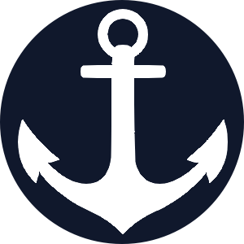

<p align="center">
  
  <h1>SysNavy</h1>
</p>

Sistema portátil para gestão de pessoas e cargos, com dados salvos localmente no navegador.

## Funcionalidades

- Cadastro, edição e exclusão de pessoas.
- Cadastro, edição e exclusão de cargos
- Vincular pessoa a um cargo.
- Tema claro/escuro.
- Backup local (exportar/importar).
- Busca, paginação e densidade da tabela.

## Como executar

```bash
npm install
npm start
```

## Como buildar

```bash
npm run build
```

Após o build, abra `build/index.html` diretamente no navegador (funciona offline).
